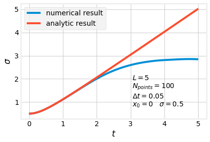
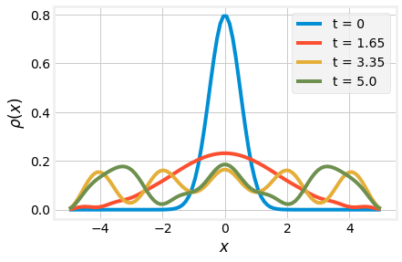

# Time dependent Schrödinger Equation in a Potential

## Important Considerations

### Set up and submission

As we did in project 04, you can work directly in the `master` branch and
commit into it.

If you have significant problems with your code you can raise an issue so that
I cant take a look (remember to put me as an assignee). However if your code
is clearly 'buggy' and it does not compile due to syntax errors I will not
provide feedback.

If you're getting compilation errors that you don't really understand we can
take a look together during office hours or class.

Don't forget to push your final commit before the submission deadline so that
I can take a look at your code.

## Assignment

In this project you will solve the *time-dependent* Schrödinger equation
$$
i \hbar \frac{\partial }{\partial t} \Psi(x, t) = \left[ - \frac{\hbar^2}{2m} \frac{\partial^2}{\partial x^2}  + V(x) \right] \Psi(x, t)
$$
using the Crank-Nicolson method.

We start by introducing the Hamiltonian operator $\hat{H} = -
\frac{\hbar^2}{2m} \frac{\partial^2}{\partial x^2}  + V(x)$ , which is the
same we had in Project 4. Then we rewrite the Schrodinger equation as

$$
\frac{\partial }{\partial t} \Psi(x, t) = - \frac{i}{\hbar} \hat{H} \Psi(x, t).
$$

The next step is to discretize $\Psi(x,t)$ as a vector: $\Psi(x,t_n) \rightarrow
\vec{\psi}^{(n)}$, where $\Psi(x_j,t_n) = {\psi_j^{(n)}}$. We then discretize
the Hamiltonian as a matrix, exactly as in Project 4 (in fact, if you want to
reuse code from Project 4, please do). The Crank-Nicolson method is to split
up the Hamiltonian, half explicit and half implicit:

$$
\frac{\partial}{\partial t} \Psi(x,t) = \frac{\vec{\psi}^{(n+1)} - \vec{\psi}^{(n)}}{\Delta t} = - \frac{i}{\hbar} \hat{H} \Psi(x,t) = \frac{1}{2} \left( -\frac{i}{\hbar} \hat{H} \vec{\psi}^{(n+1)} -\frac{i}{\hbar} \hat{H} \vec{\psi}^{(n)}\right)
$$

or

$$
\left(1 + \frac{i \Delta t}{2 \hbar} \hat{H} \right) \vec{\psi}^{(n+1)} = \left(1 - \frac{i \Delta t}{2 \hbar} \hat{H} \right) \vec{\psi}^{(n)}
$$

where $1$ is the identity matrix and $\hat{H}$ is our discretized Hamiltonian
from assignment 04. Solving for $\vec{\psi}^{(n+1)}$ results in

$$
\vec{\psi}^{(n+1)} = \left(1 + \frac{i \Delta t}{2 \hbar} \hat{H} \right)^{-1} \left(1 - \frac{i \Delta t}{2 \hbar} \hat{H} \right) \vec{\psi}^{(n)}.
$$

As you can see, this problem requires complex variables. One can either code
the problem using complex variables, or recast it as a purely real problem.
Since the problem also requires to invert a matrix along with some matrix
multiplications, and our linear algebra routines from assignment 03 work with
real numbers, I will outline the real variable approach (i.e., you will
**not** explicitly use complex numbers).

We can rewrite 

$$
\left(1 + \frac{i \Delta t}{2 \hbar} \hat{H} \right) \vec{\psi}^{(n+1)} = \left(1 - \frac{i \Delta t}{2 \hbar} \hat{H} \right) \vec{\psi}^{(n)}
$$

as

$$
\left(1 + \frac{i \Delta t}{2 \hbar} \hat{H} \right) \left[{\rm Re} \vec{\psi}^{(n+1)} + i {\rm Im} \vec{\psi}^{(n+1)} \right] = \left(1 - \frac{i \Delta t}{2 \hbar} \hat{H} \right) \left[{\rm Re} \vec{\psi}^{(n)} + i {\rm Im} \vec{\psi}^{(n)} \right]
$$

which becomes two coupled equations

\begin{align*}
	{\rm Re} \vec{\psi}^{(n+1)} - \frac{\Delta t}{2 \hbar} \hat{H} {\rm Im} \vec{\psi}^{(n+1)} & = {\rm Re} \vec{\psi}^{(n)} + \frac{\Delta t}{2 \hbar} \hat{H} {\rm Im} \vec{\psi}^{(n)} \\
	{\rm Im} \vec{\psi}^{(n+1)} + \frac{\Delta t}{2 \hbar} \hat{H} {\rm Re} \vec{\psi}^{(n+1)} & = {\rm Im} \vec{\psi}^{(n)} - \frac{\Delta t}{2 \hbar} \hat{H} {\rm Re} \vec{\psi}^{(n)}
\end{align*}

These can be combined into a "super-matrix" as 

$$
\begin{pmatrix}
1 & \frac{- \Delta t}{2 \hbar} \hat{H} \\
\frac{\Delta t}{2 \hbar} \hat{H} & 1 
\end{pmatrix}
\begin{pmatrix}
{\rm Re} \vec{\psi}^{(n+1)} \\
{\rm Im} \vec{\psi}^{(n+1)}
\end{pmatrix}
=
\begin{pmatrix}
1 & \frac{\Delta t}{2 \hbar} \hat{H} \\
\frac{-\Delta t}{2 \hbar} \hat{H} & 1 
\end{pmatrix}
\begin{pmatrix}
{\rm Re} \vec{\psi}^{(n)} \\
{\rm Im} \vec{\psi}^{(n)}
\end{pmatrix}
$$

Therefore if the wave function is discretized as a (complex) vector of length $N$, we replace it with a purely real vector of length $2N$ and purely real matrices of size $2N \times 2N$.

To evolve in time from $t_n$ to $t_{n+1}$, start with the $2N$ sized vector
$\begin{pmatrix} {\rm Re} \vec{\psi}^{(n)} \\ {\rm Im} \vec{\psi}^{(n)} \end{pmatrix}$
and perform the matrix multiplication
$$
\begin{pmatrix}
{\rm Re} \vec{\psi}^{(n+1)} \\
{\rm Im} \vec{\psi}^{(n+1)}
\end{pmatrix}
=
\begin{pmatrix}
1 & \frac{- \Delta t}{2 \hbar} \hat{H} \\
\frac{\Delta t}{2 \hbar} \hat{H} & 1 
\end{pmatrix}^{-1}
\begin{pmatrix}
1 & \frac{\Delta t}{2 \hbar} \hat{H} \\
\frac{-\Delta t}{2 \hbar} \hat{H} & 1 
\end{pmatrix}
\begin{pmatrix}
{\rm Re} \vec{\psi}^{(n)} \\
{\rm Im} \vec{\psi}^{(n)}
\end{pmatrix}
$$

Since the matrices on the right hand side of the equation contain only
constants you can store the result of multiplying the second one by the
inverse of the first one and use it to evolve for as many time steps as
necessary. For that inversion and multiplication you can ***and should*** use
your `linear_algebra` module from assignment 03. Again if your code was
general enough you won't need to do any changes to the source code.

Finally, for the projects below you will need to compute the probability
density $\rho (x_j, t_n) = \left|\Psi(x_j,t_n)\right|^2 = \left({\rm Re} \psi_j^n
\right)^2 + \left({\rm Im} \psi_j^n \right)^2$

**Note**: The linear algebra subroutines from assignment 3 should work for
arbitrarily large arrays. However, using more than a couple hundred points
seems to result in unnecessarily slow execution. However, be sure to check
that your results are stable against changing the number of lattice points for
a fixed length.

### Basic Project (80%)

Put your wavefunction in a box from $-L$ to $+L$ and set the potential $V(x)=0$.
By using the same discretization of the second derivative as in assignment 4, we implicitly
have a boundary condition that the wavefunction vanishes at the boundaries. You should
set $\hbar = m = 1$ (which is different from assignment 4). The initial wave function will be a Gaussian
$$
\Psi(x,t=0) = (2 \pi \sigma^2)^{-1/4} \exp \left(- \frac{(x-x_0)^2}{4 \sigma^2} \right).
$$

Your code should receive, via a `namelist` file given as an argument, the following: 

* The size of the box $L$: `length`
* The number of sample points in $x$: `n_points`
* The number of time steps: `n_steps`
* The size of the time step $\Delta t$: `delta_t`
* The width of the Gaussian wave function $\sigma$: `width`
* The center of the Gaussian wave function $x_0$: `center`
* The oscillator parameter $k$: `k_oscillator` (For the advanced project below)
* A file name for the results as a function of time: `time_file`
* A file name for the results of the probability density: `density_file`

After reading the input parameters your program should sample the lattice
points (In the same way it was done in assignment 4, so that `delta_x =
2*length/(n_points-1)`). This will allow you to set the initial wave function
to the Gaussian expressed above. Then your code should construct the time
evolution matrix

$$
\begin{pmatrix}
1 & \frac{- \Delta t}{2 \hbar} \hat{H} \\
\frac{\Delta t}{2 \hbar} \hat{H} & 1 
\end{pmatrix}^{-1}
\begin{pmatrix}
1 & \frac{\Delta t}{2 \hbar} \hat{H} \\
\frac{-\Delta t}{2 \hbar} \hat{H} & 1 
\end{pmatrix}
$$

Remember that the wave function will be an array of size `2*n_points`. The
first half contains a sampling of the real part of $\vec{\psi}^{(n)}$, while
the second half contains a sampling of the imaginary part. For the initial
Gaussian (which is purely real) the second half will be all zeros. In the same
vein, the time evolution matrix will be a `2*n_points` by `2*n_points` matrix.

Then you can evolve you wave function and store the different snapshots in the
`time_wave_function` array. Then you can calculate the following expectation
values for every time step.

1. The normalization $\sum_{j} \rho_j dx$, which should be constant.
2. The position $\langle x \rangle = \sum_j x_j \rho_j dx / \sum_i \rho_i dx$
3. The width $\sigma = \sqrt{\langle x^2 \rangle - \langle x \rangle^2}$, where $\langle x^2 \rangle = \sum_j x^2_j \rho_j dx / \sum_i \rho_i dx$

Finally write into two different files your results. One file should contain
those expectation values (one per column) as a function of time. The second
file should contain a few snapshots of the probability density $\rho(x)$ at
different times. For example, a snapshot for the initial values, a couple of
snapshots at intermediate times and a snapshot at the final time. Create a
jupyter notebook to plot your results. You should have four figures, one for
each expectation value and one containing the different snapshots of the
probability density. Be sure to label correctly all your figures.

#### Validating your code:

The time evolution of the width can actually be computed analytically as 

$$
\sigma(t) = \sqrt{\sigma_0^2 + \frac{\hbar^4 t^2}{4 m^2 \sigma_0^2}}, 
$$

where $\sigma_0$ is the initial width from your `namelist` file. 

Confirm that your width grows, initially, according to the analytic
prescription. After some time it will deviate because of the wall. Here is an
example run in a box with `length = 5`, `n_points = 100`, an initial Gaussian
with `center = 0`, initial width of `sigma = 0.5`, and a time step of `delta_t
= 0.05`.

You can also see the effect of the walls by plotting snapshots of the probability density

### Advanced project (20%)

Now put your wavefunction in a harmonic well, $V(x) = \frac{1}{2} k x^2$. Now
you want to follow $\langle x \rangle$ as a function of $t$. Classically, one
expects $\langle x(t) \rangle = x_0 \cos \left(\sqrt{\frac{k}{m}} t \right)$.
Do you get this? What happens if you change your initial width? I recommend a
not to large value of $k$ (say around 1.0). You should create the same plots
from the basic project for some non-zero  value of $x_0$, some $k$ (your
choice, but put your parameters on the plot), and for two different starting
widths. Make sure that $x_0$ is not too close to the boundaries of the box,
and also that the width is small enough that the tail of the wave packet is
small at the boundaries.

### Extra Credit (5%) (even for the basic project)

The Crank-Nicolson method should conserve the energy of the system. Check that
it does. (Part of the assignment is to deduce, for yourself, how to compute
the energy of the system.)

### Super fun extra credit (5%) (even for the basic project)

`matplotlib` allows the create
[animations](https://matplotlib.org/3.1.1/api/animation_api.html). Instead of
only writing a few snapshots of the density to your output file, use every
snapshot in the `time_wave_function` array. Be careful not to use `n_points`
and `n_steps` so large that you end up with unnecessarily large output files.
I found `n_points=100` and `n_steps=200`  (with `delta_t=0.05`) to be enough.
Then use all those snapshots to create an animation of the time evolution of
$\rho$. I found  the first answer of [this stackoverflow
question](https://stackoverflow.com/questions/43445103/inline-animations-in-jupyter)
to be quite helpful in displaying the animation on a jupyter notebook.

## Final notes

As usual, for full credit on all parts, your program should be well-commented,
and input and output clear and easy to use with an informative `README.md` in
your `src/` directory.